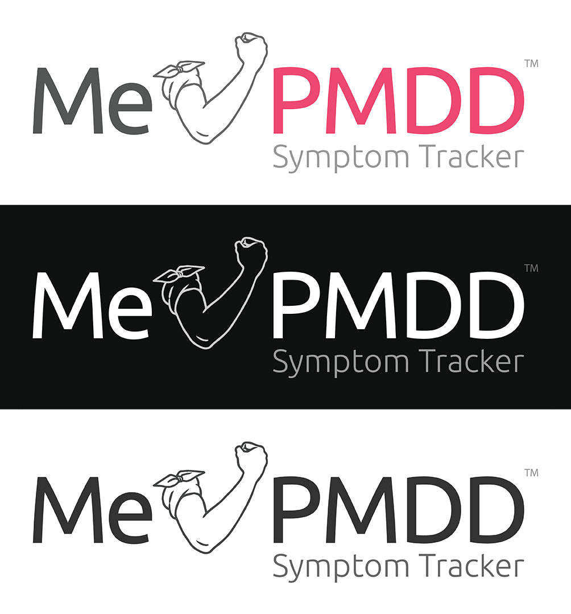

Me v PMDD Logo & Icon
===

| Logo Part        | Color Logo | Black Logo | White Logo |
|------------------|------------|------------|------------|
| Me Text          | `#555555`  | `#333333`  | `#FFFFFF`  |
| Arm Icon         | `#666666`  | `#444444`  | `#BBBBBB`  |
| PMDD Text        | `#EC4972`  | `#333333`  | `#FFFFFF`  |
| Slogan & TM Text | `#999999`  | `#666666`  | `#999999`  |

Font: https://fonts.google.com/specimen/Ubuntu

Logo Samples:
---

Logo ( no slogan ) Samples:
---

Icon Samples:
---

Icon Thick Samples ( better for smaller icons ):
---

